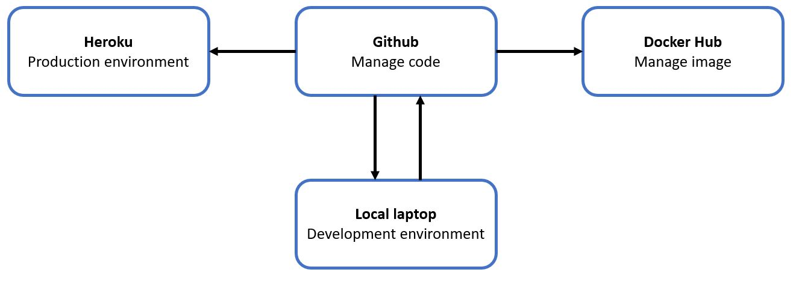
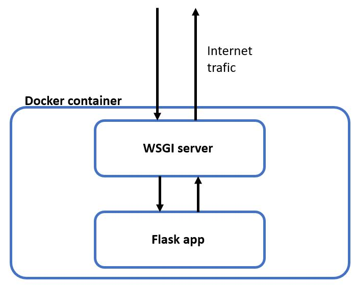

# Athletes photos classification

This repository is an ongoing personal project combining my passion for sport with data science, realized by [Florent Glauda](https://www.linkedin.com/in/florent-glauda/) and [myself](https://fr.linkedin.com/in/lucas-lherbier/en).

A live version of the app can be found at https://stormy-savannah-71478.herokuapp.com

# Table of contents

* [Description of the project](#Description) 
   * Goal
   * Description of this repository
   * Organization
* Development Workflow
   * Overall description
   * Build the Docker image
   * Run server locally
   * Download the Docker image
   * Communications inside the container
* [Extract of the application](#Application) 

## Description

### Goal

The goal of the project is to implement a *Python* server, as an application, allowing to classify pictures between famous athletes. The classification is based on an deep learning model using convolutional neural networks.  
The application is only for two sportsmen, leaders of their respective sport, [Lebron James](https://en.wikipedia.org/wiki/LeBron_James) and [Rafael Nadal](https://en.wikipedia.org/wiki/Rafael_Nadal). 

### Description of this repository

* `CNN_sport.ipynb`: it explains how the deep learning model has been created. It needs around 30s to load.
* `Dockerfile`: it creates a docker image for running the app as a container
* `heroku.yml`: it creates the heroku app. The Docker image will be built by Heroku.
* **.github/workflows**: it builds the Docker image and push it on Docker Hub in the repository `glauda/athletes_classification`. 
*  **data**: it contains 30 examples of the athletes pictures.
*  **dataset_from_google**: it contains the files to create pictures dataset automatically from Google Images. You will find all the process [here](https://www.pyimagesearch.com/2017/12/04/how-to-create-a-deep-learning-dataset-using-google-images/).
* **deploy**: it creates the *Flask* application. It is divided in diverse parts :
  * **models**: it contains the models, created in the `CNN_sport.ipynb` notebook, which will be used in the application.
  * **static**: it contains a [*CSS*](https://www.w3schools.com/css/) file for styling the application and a [*JavaScript*](https://www.w3schools.com/js/) file that adds dynamic behavior to the page.
  * **templates**: it is composed of [*HTML*](https://www.w3schools.com/html/) scripts in which the variable data can be inserted dynamically. A template is rendered with specific data to produce a final document. The goal is to avoid generating HTML content from Python code, which is inconvenient.
  * **uploads**: storage folder for all the uploaded pictures
  * `app.py`: the *Flask* application - it imports the *Flask* module, creates a web server and instances of the *Flask* class -
  * `requirements.txt`: it contains the list of all packages needed to create the Docker image.
  * `wsgi.py`:it is the WSGI (Web Server Gateway Interface) used to interface Flask server with web server in production mode.
 
 
 ### Organization
 * the pictures dataset has been automatically extracted using Google Images. The needed files are available in the folder **dataset_from_google**. A *JavaScript* script gathers image URLs which can be downloaded using a *Python* code. You will find all the process [here](https://www.pyimagesearch.com/2017/12/04/how-to-create-a-deep-learning-dataset-using-google-images/).
 * the classifier model has been developed in the `CNN_sport.ipynb` with the [*Keras*](https://keras.io) and [*TensorFlow*](https://www.tensorflow.org/?hl=fr) libraries. 
 * the web server has been developed with the micro web framework [*Flask*](https://flask.palletsprojects.com/en/1.1.x/)
 * because of problems with necessary packages, we create a [*Docker*](https://www.docker.com/) container
 * the Github workflow from [*Heroku*](https://www.heroku.com/) and [*Docker Hub*](https://hub.docker.com/) has been made
 
 
### Development workflow

#### Overall description
A Github workflow is used to build the [*Docker*](https://www.docker.com/) image and release it on [*Docker Hub*](https://hub.docker.com/). It allows building and sharing the image. Building the image on our personal laptops (with Windows) was too time consuming, especially due to the presence of library [*TensorFlow*](https://www.tensorflow.org/?hl=fr). 

The deployment in production is handled by [*Heroku*](https://www.heroku.com/). An automatic pipeline is used to build the Heroku app directly from the Github repository.

All the workflow can be summarised by the following diagram.

<figure>
  
  <figcaption> <small><small> <i> Figure 4: Development Workflow.</i> </small> </figcaption>
</figure>

#### Build the Docker image 
Add a tag *build* to your commit, then push it on Github.
```
git add <updated-files>
git commit -m "<my-commit-message>"
git tag -a build "<build message>"
git push
```
The image will be build by the Github CI, and then published at https://hub.docker.com/repository/docker/glauda/athletes_classification

#### Run server locally
Download the Docker image
`docker pull glauda/athletes_classification:latest`

Create and run the container. If you want to modify the server and see the changes, go to the project main directory and bind the *deploy* folder to the container when running it.

Some changes might not appear because they are cached by your browser. For example, with Google Chrome, you can press `Crtl+Cap+r` to "force refresh" the page.
```
docker run -p 8080:8080 -it -v "$(pwd)"/deploy:/deploy glauda/athletes_classification python3 /deploy/app.py
```

Otherwise, you can open a shell the container and start the server
```
docker run -p 8080:8080 -it -v "$(pwd)"/deploy:/deploy glauda/athletes_classification /bin/bash
python3 app.py
```

Go to your browser, the server will be available at http://localhost:8080/


 ### Communications inside the container
Flask is not optimized to be used directly as a web server in production moode : you will find more details [here](https://flask.palletsprojects.com/en/1.1.x/deploying/). This is why a `wgsi` server is used to interface with the Flask server. The wsgi server is run using the *gunicorn* command. 

<figure>
  
  <figcaption> <small><small> <i> Figure 5: Communications inside the container.</i> </small> </figcaption>
</figure>

### Application

<figure>
  
  <figcaption> <small> <i> Figure 1: Python server interface.</i>  </small> </figcaption>
</figure>
<br>

<figure>
  
  <figcaption> <small> <i> Figure 2: Prediction for a Nadal picture. </i>  </small> </figcaption>
</figure>

<br>

<figure>
  
  <figcaption> <small><small> <i> Figure 3: Prediction for a James picture.</i> </small> </figcaption>
</figure>

